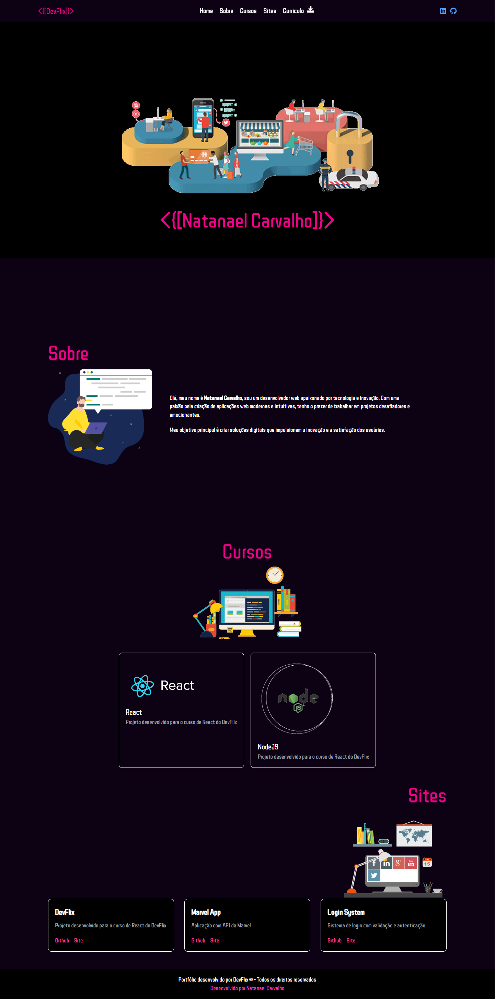

# 🌐 Portfólio | Natanael Carvalho

Este projeto é um portfólio pessoal desenvolvido com **React** e **TailwindCSS**, com visual moderno, responsivo e totalmente customizado. Foi criado para apresentar meus projetos, cursos e perfil profissional.

---

## 🚀 Tecnologias utilizadas

- [React](https://reactjs.org/)
- [Vite](https://vitejs.dev/) (para build rápido)
- [TailwindCSS](https://tailwindcss.com/)
- [React Icons](https://react-icons.github.io/react-icons/)
- HTML5 / CSS3

---

## 🧠 Estrutura do Projeto

src/
├── assets/ # Imagens, vídeos, ícones
├── components/ # Componentes reutilizáveis (Header, Footer, Card, Hero)
├── pages/ # Páginas (Home, Sobre, Cursos, Sites)
├── layout/ # Layout geral da aplicação
├── utils/ # Dados estáticos (projetos, cursos)
├── App.jsx # Componente principal
└── main.jsx # Ponto de entrada


---

## 🧩 Funcionalidades

- ✅ Hero com vídeo de fundo e foto sobreposta
- ✅ Menu de navegação fixo e responsivo com ícone hambúrguer
- ✅ Seções: Home, Sobre, Cursos, Sites
- ✅ Cards de projetos dinâmicos com layout responsivo
- ✅ Botão para download do currículo com ícone
- ✅ Estilo neon pixel com fonte retro (`Press Start 2P`)
- ✅ Layout totalmente responsivo para desktop e mobile

---

## 🖼️ Preview do layout

 <!-- troque por uma imagem do projeto -->

---

## 📁 Como rodar o projeto localmente

1. Clone este repositório:

```bash
git clone https://github.com/seuusuario/projeto-portfolio.git

npm install

npm run dev

http://localhost:5173


📄 Licença
Este projeto é de uso pessoal. Fique à vontade para usar como referência ou adaptar para o seu próprio portfólio.


---


